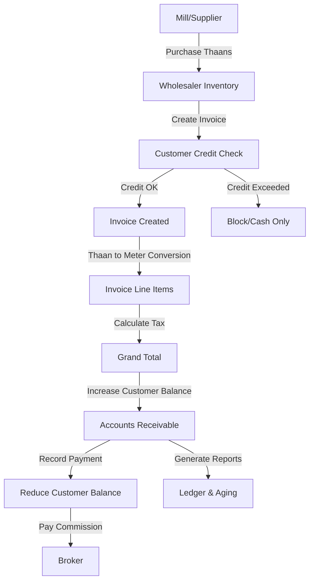

# Textile Wholesale Workflow - Pakistan Domain Knowledge

## Overview

This document details how Tenvo handles the **textile wholesale business** in Pakistan, particularly for businesses dealing in **thaans** (fabric rolls) with meter-based measurements. This covers the complete workflow from inventory management to invoicing, payments, and credit management.

---

## Business Model

### Pakistani Textile Wholesale Context

**Key Players:**
- **Wholesalers**: Trade in large quantities (thaans/rolls), primarily to retailers and tailors
- **Markets**: Jama Cloth (Karachi), Lunda Bazaar, Tariq Road, Faisalabad Market
- **Mills**: Gul Ahmed, Nishat Mills, Sapphire, Al-Karam, Crescent, Masood, Kohinoor, Interloop
- **Customer Types**: Retailers, Wholesalers (sub-distributors), Tailors, Boutiques
- **Broker/Agent**: Commission-based intermediaries (typically 1-3% of transaction value)

**Product Types:**
- Raw Fabric (Kora): Unprocessed fabric from mills
- Finished Fabric: Dyed, printed, embroidered
- Fabric Types: Lawn, Cotton, Wash & Wear, Chiffon, Silk, Khaddar, Linen, Jacquard, Karandi, etc.

---

## 1. Product & Inventory Management

### Product Fields (Domain Data)

Textile wholesale products have specialized fields stored in `products.domain_data`:

```javascript
{
  "articleno": "GA-101",           // Article Number (Primary ID)
  "designno": "D-505",             // Design Number
  "fabrictype": "Lawn",            // Fabric Type
  "colorshade": "Navy Blue",       // Color/Shade
  "korafinished": "Finished",      // Processing State
  "widtharz": 44,                  // Width in inches (Arz)
  "thaanlength": 40,               // Meters per Thaan
  "suitcutting": 2.25,             // Meters per Suit
  "sourcing": "local",             // Local/Imported
  "origin": "Faisalabad"           // Origin location
}
```

### Units of Measurement

**Primary Units:**
1. **Thaan (تھان)**: Fabric roll - variable length (35-45 meters, default 40m)
2. **Meter (میٹر)**: Base unit for all conversions
3. **Gaz (گز)**: Traditional South Asian unit = 0.9144 meters (1 yard)
4. **Suit (سوٹ)**: Fabric needed for one suit (typically 2.25m)
5. **Guth (گٹھ)**: Bundle of 10 suits
6. **KG**: For fabric sold by weight

**Conversion Logic:**
```javascript
// 1 Thaan = 40 meters (configurable per product)
qty: 2 thaan × 40m = 80 meters

// 1 Suit = 2.25 meters (configurable per product)
qty: 10 suits × 2.25m = 22.5 meters

// 1 Gaz/Yard = 0.9144 meters (fixed British-era standard)
qty: 50 gaz × 0.9144 = 45.72 meters

// 1 Guth = 10 suits
qty: 3 guth × 10 suits × 2.25m = 67.5 meters
```

### Inventory Features

**Enabled Features:**
- ✅ Thaan Management (roll tracking)
- ✅ Batch Tracking (lot-based)
- ✅ Multi-Location Inventory (warehouse support)
- ✅ Article-wise Stock (by Article No + Design No)
- ✅ Barcode Scanning (Article No as barcode)
- ✅ Stock Valuation (Average cost method)
- ✅ Reorder Points
- ✅ Season-wise Analysis
- ❌ Serial Tracking (not needed for fabric)
- ❌ Expiry Tracking (fabric doesn't expire)
- ❌ Manufacturing BOM (traders only, not mill manufacturing)

**Batch/Roll Tracking:**
- Each thaan can be tracked as a batch
- Roll/Bale number stored in `batch_number`
- Useful for quality control and traceability back to mills

---

## 2. Invoicing & Sales

### Invoice Line Items

**Textile-Specific Columns:**
- Roll/Bale # (batch identifier)
- Article # (primary product identifier)
- Design # (variant/style identifier)
- Thaan Length (meters per thaan for this line)

### Quantity & Unit Conversions on Invoices

**Example Invoice Scenarios:**

#### Scenario 1: Selling by Thaan (Wholesale)
```
Product: Gul Ahmed Lawn
Article No: GA-505
Design No: D-Summer-21
Unit: Thaan
Qty: 5 thaan
Thaan Length: 40 meters
Rate: PKR 6,000 per thaan

Calculation:
- Display: "5 Thaan × 40m = 200m"
- Line Total: 5 × 6,000 = PKR 30,000
- Meters Billed: 200 meters
```

#### Scenario 2: Selling by Meter (Retail Cut)
```
Product: Same fabric
Unit: Meter
Qty: 80 meters
Rate: PKR 150 per meter

Calculation:
- Display: "80 Meter"
- Line Total: 80 × 150 = PKR 12,000
```

#### Scenario 3: Selling by Suit
```
Product: Premium Wash & Wear
Unit: Suit
Qty: 20 suits
Suit Cutting: 2.5 meters per suit
Rate: PKR 375 per suit (2.5m × 150/meter)

Calculation:
- Display: "20 Suits = 50m"
- Line Total: 20 × 375 = PKR 7,500
- Meters Used: 50 meters
```

### Auto-Fill Logic

When a user changes the unit on an invoice line:

**Switching to "Thaan":**
```javascript
// Auto-populate from product domain_data
thaan_length = product.domain_data.thaanlength || 40

// Convert per-meter rate to per-thaan rate
if (product.price is per-meter):
  rate = product.price × thaan_length
  // e.g., PKR 150/m × 40m = PKR 6,000/thaan
```

**Switching to "Suit":**
```javascript
suit_cutting = product.domain_data.suitcutting || 2.25
rate = product.price × suit_cutting
```

**Implementation:** `lib/utils/invoiceHelpers.js` → `autoFillTextileLineOnUnitChange()`

### Printing & Display

**Invoice PDF/Thermal Receipt:**
- Shows both quantity and meter equivalent
- Example: "5 Thaan (40m ea) = 200m"
- Urdu support: "5 تھان (40م ہر) = 200م"

---

## 3. Taxation (Pakistan FBR Compliance)

### Tax Categories for Textile

```javascript
taxCategories: [
  'Sales Tax 17%',                           // Standard rate (pre-2024)
  'Sales Tax 18%',                           // Current standard rate
  'Zero Rated (Export)',                     // Export transactions
  'Unregistered Buyer (3% Further Tax)',     // Non-filer buyers
]
```

### Tax Rules

1. **Registered Buyers (NTN Filers)**: Standard 18% GST
2. **Unregistered Buyers (Non-Filers)**: 18% GST + 3% Further Tax = 21% total
3. **Export**: Zero-rated (0% GST)
4. **Withholding Tax**: On payments to suppliers (deducted at payment)

**Implementation:**
- Tax stored per invoice line
- Further tax tracked separately for FBR reporting
- NTN status checked from `customers.domain_data.ntn_status`

---

## 4. Credit Management (Udhaar System)

### Customer Credit Workflow

**Database Fields:**
```sql
customers:
  - credit_limit (DECIMAL)        -- Maximum outstanding allowed
  - outstanding_balance (DECIMAL) -- Current unpaid balance
  - payment_terms (TEXT)          -- e.g., "Credit 30 Days"
```

### Credit Limit Enforcement

**Credit Guard Service** (`lib/services/CreditGuardService.js`):

```javascript
// Check before creating invoice
const creditCheck = await checkCreditLimit(
  businessId,
  customerId,
  invoiceGrandTotal
);

if (!creditCheck.allowed) {
  // Block invoice creation
  // Show: "Credit limit exceeded. Limit: PKR 500,000, 
  //        Current: PKR 450,000, New Invoice: PKR 100,000"
}
```

**Business Rules:**
- `credit_limit = 0 or NULL` → Unlimited credit (or not enforced)
- `credit_limit > 0` → Strict enforcement
- `outstanding_balance` increases on invoice creation
- `outstanding_balance` decreases on payment receipt

### Payment Terms

Common in Pakistan textile trade:
- **Cash** (Immediate)
- **Credit 15 Days**
- **Credit 30 Days**
- **Cheque (PDC)** - Post-dated cheque
- **Cash on Delivery (COD)**

---

## 5. Payments & Receivables

### Recording Payments

**Invoice Payment Service** (`lib/services/InvoicePaymentService.js`):

```javascript
await recordPayment({
  businessId,
  invoiceId,
  amount: 50000,              // Partial payment allowed
  paymentMethod: 'bank_transfer',
  referenceNumber: 'CHQ-12345',
  notes: 'Cheque payment',
  userId,
});
```

**Payment Flow:**
1. Insert record in `invoice_payments`
2. Calculate new invoice balance via `calculate_invoice_balance()` function
3. Update customer `outstanding_balance` (decrease by payment amount)
4. Update invoice `payment_status`: `unpaid` → `partial` → `paid`
5. Post accounting entry (debit bank/cash, credit accounts receivable)

### Partial Payments

Textile wholesalers commonly receive payments in installments:

```
Invoice: PKR 100,000

Payment 1: PKR 30,000 (advance)
  → Invoice status: partial
  → Customer balance: PKR 70,000

Payment 2: PKR 50,000
  → Invoice status: partial
  → Customer balance: PKR 20,000

Payment 3: PKR 20,000
  → Invoice status: paid
  → Customer balance: PKR 0
```

### Accounts Receivable (A/R) Aging

**Aging Buckets:**
- Current (0-30 days)
- 31-60 days
- 61-90 days
- 91-120 days
- Over 120 days

**Implementation:** `lib/utils/agingBuckets.js` → `bucketAgingRows()`

**Reports:**
- Customer Ledger: All invoices and payments per customer
- A/R Aging Report: Outstanding invoices grouped by age
- Collection Follow-up: Overdue invoices needing action

---

## 6. Broker/Agent Commission

### Commission Structure

**Common Practice:**
- Broker brings buyer and seller together
- Commission: 1-3% of invoice value
- Paid after payment collection (not on invoice creation)

### Expense Tracking

**Category:** `agent_commission`

```javascript
{
  category: 'agent_commission',
  amount: 3000,              // 1% of PKR 300,000 sale
  description: 'Broker Hamza - Invoice #INV-001',
  reference_invoice_id: 'xxx',
  account_code: 'PROFESSIONAL_FEES',
}
```

**Implementation:** `lib/utils/expenseCategories.js` → textile-wholesale category

---

## 7. Reports

### Essential Textile Wholesale Reports

1. **Design-wise Sales**: Performance by design number
2. **Article-wise Stock**: Current stock by article
3. **Customer Ledger**: All transactions per customer (invoices + payments)
4. **Supplier Ledger**: All purchase transactions per supplier
5. **Stock Summary (Thaan/Meter)**: Inventory valuation in both units
6. **Daily Sales Report**: Daily revenue and unit sales
7. **Broker Commission Report**: Commission due/paid by broker
8. **Season Performance**: Peak months analysis (April-July, Nov-Dec)
9. **Dead Stock Analysis**: Slow-moving designs/articles
10. **FBR Tax Report**: GST summary for tax filing

### Seasonal Intelligence

**Peak Months:**
- **Eid Collection** (Pre-Ramadan/Eid ul-Fitr): March-May
- **Wedding Season**: October-December
- **Summer Collection**: April-July
- **Winter Collection**: September-November

**AI Recommendations:**
- Lock fabric prices from mills 10-12 weeks before Eid
- Stock printed/embroidered fabrics before peak months
- Clear dead stock via off-season discounts

---

## 8. Workflow Summary

### Complete Business Flow



### Day-to-Day Operations

**Morning:**
1. Check stock levels by article/design
2. Review pending orders from retailers
3. Create invoices (thaan/meter/suit units)
4. Print thermal bills for delivery

**Afternoon:**
5. Receive payments (cash/cheque/bank transfer)
6. Record payments against invoices
7. Update customer balances
8. Follow up on overdue receivables

**Evening:**
9. Generate daily sales report
10. Check broker commissions due
11. Review stock valuation
12. Plan next day's operations

**Month-End:**
- Generate customer ledger statements
- A/R aging analysis
- Pay broker commissions
- File GST returns with FBR
- Reconcile bank statements

---

## 9. Key Database Tables

### Products
```sql
products:
  - id (UUID)
  - sku (TEXT)
  - name (TEXT)
  - unit (TEXT)                    -- thaan, meter, suit, gaz
  - price (DECIMAL)                -- per unit
  - cost_price (DECIMAL)           -- for GP calculation
  - domain_data (JSONB)            -- articleno, designno, thaanlength, etc.
  - unit_conversions (JSONB)       -- { "gaz": 0.9144, "yard": 0.9144 }
```

### Invoices
```sql
invoices:
  - id (UUID)
  - invoice_number (TEXT)
  - customer_id (UUID)
  - grand_total (DECIMAL)
  - payment_status (TEXT)          -- unpaid, partial, paid
  - payment_terms (TEXT)           -- Credit 30 Days, etc.
```

### Invoice Items
```sql
invoice_items:
  - id (UUID)
  - invoice_id (UUID)
  - product_id (UUID)
  - quantity (DECIMAL)
  - unit (TEXT)
  - rate (DECIMAL)
  - thaan_length (DECIMAL)         -- meters per thaan
  - suit_cutting (DECIMAL)         -- meters per suit
  - batch_number (TEXT)            -- roll/bale identifier
  - article_no (TEXT)
  - design_no (TEXT)
  - line_total (DECIMAL)
```

### Invoice Payments
```sql
invoice_payments:
  - id (UUID)
  - business_id (UUID)
  - invoice_id (UUID)
  - amount (DECIMAL)
  - payment_method (TEXT)
  - payment_date (TIMESTAMP)
  - reference_number (TEXT)        -- cheque number, etc.
  - received_by (TEXT)             -- user ID
```

### Customers
```sql
customers:
  - id (UUID)
  - name (TEXT)
  - credit_limit (DECIMAL)
  - outstanding_balance (DECIMAL)
  - payment_terms (TEXT)
  - domain_data (JSONB)            -- ntn_status, shop_name, market_location
```

---

## 10. Technical Implementation

### Key Files

**Domain Knowledge:**
- `lib/domainData/textile.js` - Textile wholesale configuration
- `lib/domainKnowledge.js` - Domain resolver

**Unit Conversions:**
- `lib/utils/fabricUnitConversions.js` - Thaan/meter/gaz/suit conversions
- `lib/utils/invoiceHelpers.js` - Invoice line quantity resolution

**Invoicing:**
- `lib/services/InvoiceService.js` - Invoice CRUD
- `lib/services/InvoicePaymentService.js` - Payment recording

**Credit Management:**
- `lib/services/CreditGuardService.js` - Credit limit enforcement
- `lib/utils/agingBuckets.js` - A/R aging

**Expenses:**
- `lib/utils/expenseCategories.js` - Broker commission category

### Validation Schemas

```javascript
// lib/validation/domainSchemas.js
TextileFashionSchema = z.object({
  articleno: z.string().optional(),
  designno: z.string().optional(),
  fabrictype: z.string().optional(),
  colorshade: z.string().optional(),
  korafinished: z.string().optional(),
  widtharz: z.union([z.string(), z.number()]).optional(),
  thaanlength: z.union([z.string(), z.number()]).optional(),
  suitcutting: z.union([z.string(), z.number()]).optional(),
  sourcing: z.string().optional(),
  origin: z.string().optional(),
});
```

---

## 11. Urdu Language Support

### UI Labels (Urdu)

```javascript
// lib/translations.js
{
  thaan: 'تھان',
  meter: 'میٹر',
  gaz: 'گز',
  suit: 'سوٹ',
  guth: 'گٹھ',
  article_no: 'آرٹیکل نمبر',
  design_no: 'ڈیزائن نمبر',
  fabric_type: 'کپڑے کی قسم',
  kora: 'کورا',
  finished: 'تیار شدہ',
  broker_commission: 'بروکر کمیشن',
  customer_ledger: 'کسٹمر لیجر',
  credit_limit: 'کریڈٹ حد',
  outstanding_balance: 'باقی رقم',
}
```

### Thermal Receipt (Urdu)

```
تھانوں کی فروخت

آرٹیکل: GA-505
ڈیزائن: D-Summer-21
مقدار: 5 تھان (40م ہر) = 200م
قیمت: 6,000 روپے فی تھان
کل: 30,000 روپے
```

---

## 12. Regional Market Features

### Pakistan-Specific

**Payment Gateways:**
- JazzCash
- EasyPaisa
- Bank Transfer
- Cheque
- Cash

**Tax Compliance:**
- FBR (Federal Board of Revenue)
- NTN (National Tax Number)
- SRN (Sales Tax Registration Number)
- Further Tax (3% on non-filers)
- Withholding Tax

**Markets:**
- Jama Cloth (Karachi)
- Lunda Bazaar (Karachi)
- Tariq Road (Karachi)
- Faisalabad Textile Market

**Brands:**
- Gul Ahmed, Nishat, Sapphire, Al-Karam, Sana Safinaz
- Local mill brands
- Imported fabrics (Turkey, China)

---

## Conclusion

The textile wholesale workflow in Tenvo is designed specifically for Pakistani wholesalers dealing in thaans, with:

✅ Meter-based conversions (thaan, gaz, suit, guth)  
✅ Article/Design tracking  
✅ Credit limit enforcement (udhaar system)  
✅ Partial payment support  
✅ Broker commission tracking  
✅ FBR tax compliance  
✅ A/R aging and collection follow-up  
✅ Urdu language support  
✅ Seasonal intelligence (Eid peaks)

This enables wholesalers to manage their entire operation from purchase to payment collection while maintaining strict credit control and tax compliance.
